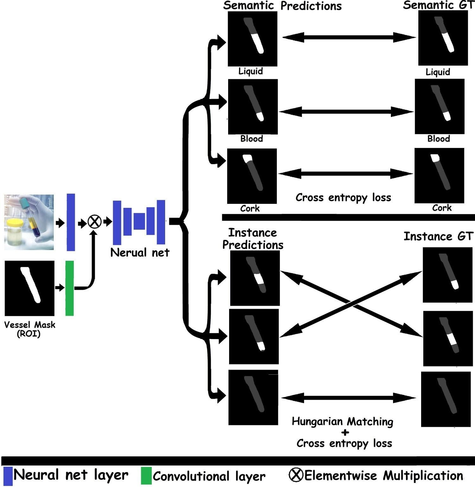
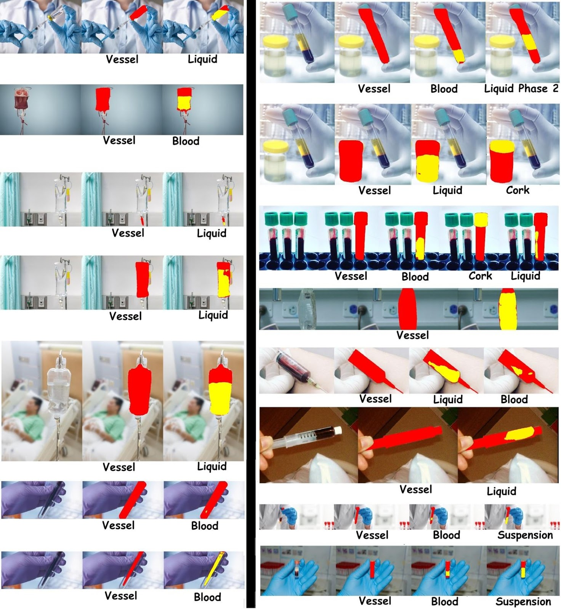
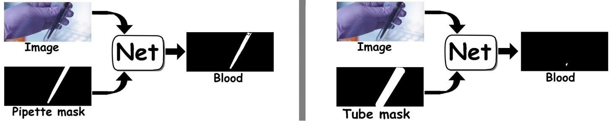

# Segmenting specific region of an image using neural that receive a container ROI mask and segment the content of this mask in the image

# Detecting segmenting liquid materials inside containers for medical and chemistry labs. 

## General
See paper [Computer vision for liquid samples in hospitals and medical labs using hierarchical image segmentation](https://arxiv.org/ftp/arxiv/papers/2105/2105.01456.pdf) for details.

This code for a neural net that receives an image and an attention mask in the image and segments the content of this mask in the image
using both instance and semantic segmentation. The ROI mask covers given glassware or transparent container in the image, and the net segments the content of this vessel, meaning liquid and other material phases (Figure 1-3).
This segmentation includes both semantic and instance segmentation.  

A trained and ready to run model can be download from [here](https://drive.google.com/file/d/1uqvTqEFqMDXCuoEDlfm3yjNnmpw2bX-b/view?usp=sharing).

The net is designed to work with the LabPics datasets that can be downloaded from [here](https://zenodo.org/record/4736111) or [here](https://www.kaggle.com/sagieppel/labpics-chemistry-labpics-medical)

Figure 1: net structure prediction and training.

# Requirements
## Hardware
For using the trained net for prediction, no specific hardware is needed, but the net will run much faster on Nvidia GPU.

For training the net, an Nvidia GPU is needed (the net was trained on Titan XP 16GB)

## Software:
This network was run with Python 3.7 [Anaconda](https://www.anaconda.com/download/) with  [Pytorch](https://pytorch.org/) and OpenCV package.

# Setup for running prediction
1) Install [Anaconda](https://www.anaconda.com/download/)
2) Create a virtual environment with the required dependencies ([Pytorch](https://pytorch.org/), torchvision, scipy and OpenCV): *conda env create -f environment.yml*
3) Activate the virtual environment: *conda activate vessel-segmentation*
4) Download the code with trained model weight from [here](https://drive.google.com/file/d/1uqvTqEFqMDXCuoEDlfm3yjNnmpw2bX-b/view?usp=sharing).

# Running Example prediction on one image and one vessel mask
1. Download pretrained model from [here](https://drive.google.com/file/d/1uqvTqEFqMDXCuoEDlfm3yjNnmpw2bX-b/view?usp=sharing) or train net using the instruction in the Training section
2. Open RunExample.py
3. Set pretrained model path to the Trained_model_path parameter (should be set as defult if you using pretrained).
4. Set the input image file path to TestImage parameter or leave it as is and use the example image supplied with this code.
5. Set the input ROI/Vessel mask file path to TestMask parameter or leave it as is and use the example mask supplied with this code. The vessel mask should be a binary mask that covers the region of the vessel to be segmented.
6. Set output folder to the OutDir parameter (or leave as is)
7. Run the script
8. output segmentation maps would appear in the OutDir folder.

# Training the net
Train.py script should run out of the box with the example training data in this folder.

1. Download the LabPics chemistry data set from [here](https://zenodo.org/record/4736111) or [here](https://www.kaggle.com/sagieppel/labpics-chemistry-labpics-medical)
2. Open the Train.py script
3. Set the path to the LabPics chemistry train set into the  ChemLabPicsDir parameter.
4. Set the path to the LabPics medical train set into the MedLabPicsDir parameter.
5. Run the script 
6. Output trained model will appear in the /log subfolder or any folder set in the Trained_model_Path parameter.
7. For additional training parameters, see the "Input parameters" section in TRAIN.py

# Evaluation:
Run prediction on the LabPics test set.

1. Download pretrained model from [here](https://drive.google.com/file/d/1uqvTqEFqMDXCuoEDlfm3yjNnmpw2bX-b/view?usp=sharing) or train net using the instruction in the Training section
2. Download the LabPics  dataset from [here](https://zenodo.org/record/4736111) or [here](https://www.kaggle.com/sagieppel/labpics-chemistry-labpics-medical)
3. Open InferenceLabPicsTestSet.py script
4. Set the LabPics test set folder path to the InputDir parameter
5. Set pretrained model path to Trained_model_path parameter. Should be already set if you using pretrained model   
5. Set output folder to OutDir
6. Run script.
7. The results would appear in the OutDir path 

(These results can be used as input for the LabPics evaluation scripts)

## Example Results
A detailed description of the net and results can be found in [here](https://arxiv.org/ftp/arxiv/papers/2105/2105.01456.pdf)
Some examples are shown in Figure 2.

Figure 2:Selected results from the vessel content prediction nets. The vessel mask that was used as an input to the net is marked in red. Each panel shows a predicted segment inside the vessel (yellow) and its predicted class below the panel.

## Net architecture
The net architecture can be seen in Figure 1. 
The net is based on a fully convolutional neural net (FCN) with the vessel mask as input. The vessel mask is processed using a single convolutional layer and is merged with the first feature map of the main net by elementwise multiplication. The output of the net is a set of binary masks for each segment. Predicted segment masks are divided into semantic masks and instance masks: Predicted semantic masks are matched to their corresponding GT semantic masks based on class. Predicted instance masks are matched to the closest instance in the GT masks (based on the IOU similarity) using the Hungarian matching algorithm. The loss for each mask is calculated using the elementwise cross-entropy function between GT and the predicted mask. Note that the vessel mask is overly on the output masks (dark grey) for visualization only and is not really part of the output.

## Predicting Hierarchies

Figure 3: Left: If the pipette mask is used as an input for the net, the net predicts the blood segment directly inside the pipette; right: If the mask of the tube containing the pipette is used as input, the net will ignore the blood inside the pipette and will only predict the direct content of the tube.

Most images used in this paper were taken with permission from Shutterstock.

